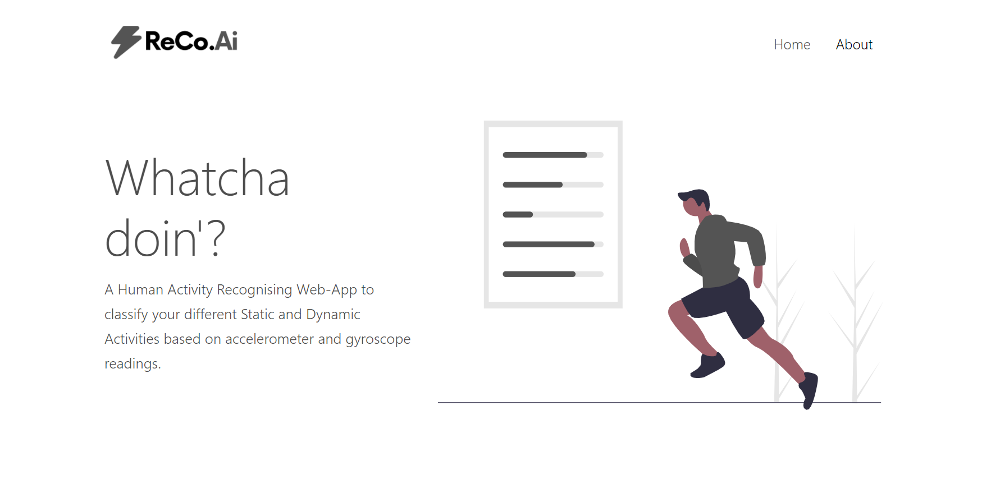
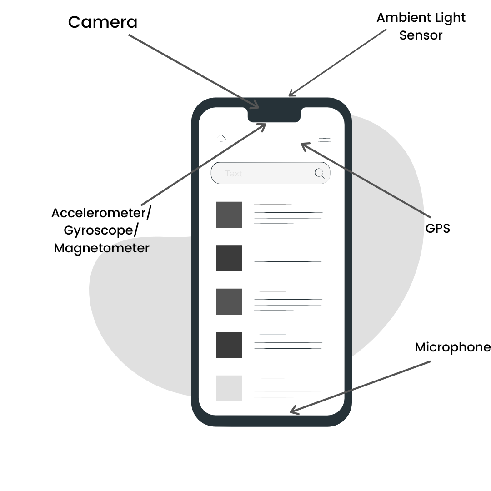

	<h2 align="center"> Whatcha doin'? </h2>
	<h4 align="center">A Human Activity Recognising Deep Learning based Web-Application to classify your different Static and Dynamic Activities based on accelerometer and gyroscope readings. <h4>
	
 

	 
[Checkout the Project Demonstration and Explanation Video Here!](https://youtu.be/5ydDAwN0fu4)

	 

---

## Preview

## Functionalities
- [ ]  Predicts the activity that a person is performing based on Gyroscopic and Accelerometer Readings.
- [ ]  The different Static and Dynamic activities considered are:
<ol>
<li>Walking
<li>Walking upstairs
<li>Walking downstairs
<li>Sitting
<li>Standing
<li>Laying
</ol>

- [ ] Minimal UI with an eye-soothing design.

 
 
<h1>Abstract</h1>

Mobile phones or smartphones have seen a gradual surge in becoming the central communication device in people’s lives. These tiny technological mastery, equipped with a set of sensors have an ability to simultaneously function as a platform for human activity recognition. The embedded sensors such as the <strong> accelerometer, digital compass, gyroscope, GPS and camera </strong>are enabling applications spanning across various domains. These sensors pave way to easier and accessible human activity recognition
              With such capabilities, the smartphones have immense applications in healthcare. 
                 
              Smart environments can be developed to provide support to people with risk factors when it comes to living independently.
              We propose a categorization of 6 human activities:
               
              <ol>
                <li> Walking</li>
                <li> Walking upstairs</li>
                <li> Walking downstairs</li>
                <li> Sitting</li>
                <li> Standing</li>
                <li> Laying</li>
              </ol>
              We divide this into two large categories:
               
              <ol><li>Static( standing, sitting, laying) </li>
              <li> Dynamic( Walking, walking upstairs, walking downstairs).</li>
            </ol>  We classify the activities performed by the person using the sensor data and report the results,challenges and project prospects.
              

  

<h1>TARGET AUDIENCE</h1>
 
 The application targets people who need monitoring and help with their daily activities,especially those with loss of cognitive autonomy. It aims on determining the activities of the person based on sensor data. 
              The primary implementation of the application is in healthcare, especially for monitoring people undergoing physiotherapy, physical trauma recovery and the elderly. 
              

<h1>DATASET</h1>
 

              The dataset used was the <a href="https://archive.ics.uci.edu/ml/datasets/human+activity+recognition+using+smartphones"> Human Activity Recognition Using Smartphones Data Set.
              </a>
 

<h3> Description:</h3>

The data was obtained by carrying out experiments on a group of 30 people within the ages of 19-48 years.
The activities performed were :walking,walking upstairs, walking downstairs, sitting, standing, laying.
The data was obtained by wearing a smartphone on the waist. 
The embedded accelerometer and gyroscope were used to capture linear acceleration and angular velocity for all the 3 axes at a rate of 50Hz.

  

<h3>
Attributes:</h3>
For each record in the dataset it is provided:  
<ol>
  <li>
Triaxial acceleration from the accelerometer (total acceleration) and the estimated body acceleration. </li>
<li> Triaxial Angular velocity from the gyroscope. </li>
<li> A 561-feature vector with time and frequency domain variables. </li>
<li> Its activity label. </li>
<li> An identifier of the subject who carried out the experiment. </li>
</ol>
 

<h3>
Sensor readings:</h3>
Accelerometer and Gyroscope readings

<h1>SUGGESTED SKELETAL ARCHITECTURE</h1>

Activity recognition systems have three main components:
              A low-level sensing module that continuously gathers relevant information about activities using microphones, accelerometers, light sensors, and so on.
               
             A feature processing and selection module that processes the raw sensor data into features that help discriminate between activities 
              A classification module that uses the features to infer what activity an individual or group of individuals is engaged
             

<h1>MODEL</h1>

              The basic model principle applied here are deep learning networks with <strong> LSTM as their foundational functionalities </strong>. The model has been implemented via the latest version of <strong> Keras (Keras 2.4.2) with a tensorflow backend. </strong>
              
  The model uses LSTM layers because of two main reasons: 
               
              <ol><li>
To avoid vanishing and exploding gradients</li>
<li>
To make best learning sense out of incomprehensible and noisy data </li></ol>
  

The dataset used here is huge and has noisy values, LSTM proves to be the best model by eradicating the complete need to go through the noisy data and undergo noise attenuation manually. As the data is also huge the gradient descent method usually undergoes vanishing or exploding gradients which is managed by LSTM as well.
Architecture:
The model’s data is using a mini batch of size 16 and is trained over 30 epochs. It contains 32 hidden layers of tan-h LSTM. A dropout layer of 0.5 parameter is passed to reduce the risk of overfitting. The architecture ends with a dense layer with an activation function of sigmoid.
As the classification is multiclass, hence, the loss used is categorical cross entropy. The model is evaluated over the ‘rmsprop’ function and measured over ‘accuracy’ metrics.

  

An input dimension of 9 parameters accreted with 32 LSTM layers form a recondite convoluted learning network, which ends in a dense connected layer to bring out all the possible combinations of nodes for the module.

<h1>CHALLENGES</h1>

              <ol>
                <li>
              Intraclass variation and interclass similarity</li>
              <li>  Recognition under real world settings viz. Complex environmental factors,multiple subjects
              </li> <li> Data Security </li>
            <li>  Availability of technology </li> 
           <li>   Scalability  </li>
            <li>  Adaptability </li>
            </ol>
             

<h1>PROJECT PROSPECTS</h1>
          

          

            
 <strong> Ambient Assisted Living
              Ambient Assisted Living (AAL) </strong>environments encompass technical systems and the Internet of Things (IoT) tools to support seniors in their daily routines. They aim to enable seniors to live independently and safely for as long as possible when faced declining physical or cognitive capacities.
              The demarcation between traditional and smart systems is  automation. A vast number of existing commercial projects are based on predefined rules and actions,which can be changed manually, thereby reducing efficiency. By integrating IOT and Artificial Intelligence, we get a futuristic amalgamation:   Ambient Intelligence which has immense prospects to help the ailing.
              
Visual human activity recognition 
Smart environments which include cameras and sensors can be used to obtain images and hence can be used for surveillance and monitoring. This is a viable addition to the project which makes it even serviceable and gives it a commercial use case.
              
              
             
 

<h3>REFERENCES</h3>
          

          

              <a href=" https://github.com/STRCWearlab/DeepConvLSTM">
              https://github.com/STRCWearlab/DeepConvLSTM</a>

 
              <a href="http://www.mdpi.com/1424-8220/16/1/115/html">
              http://www.mdpi.com/1424-8220/16/1/115/html
            </a>
              
             

  

## Contributors

<table>
<tr align="center">

<td>

Hritik Bhandari

</td>

<td>

Akshat Anand

</td>

<td>

Pratyaksh Bhalla

</td>

<td>

Gayathri Seetharaman

</td>

<td>
</tr>
  </table>
  
## License

	Made with :heart: by <a href="https://dscommunity.in">DS Community SRM</a>

